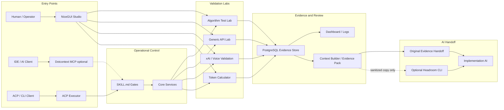
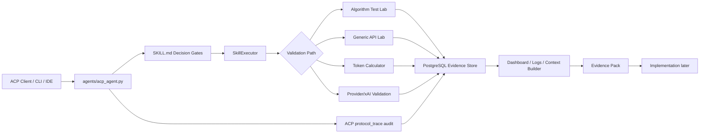
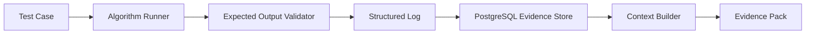
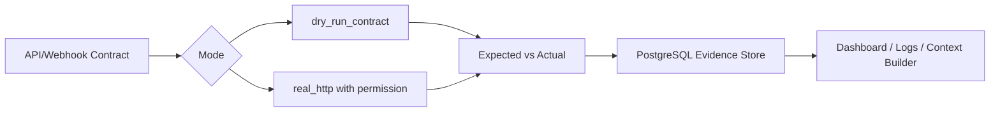
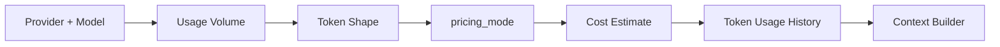
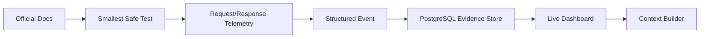
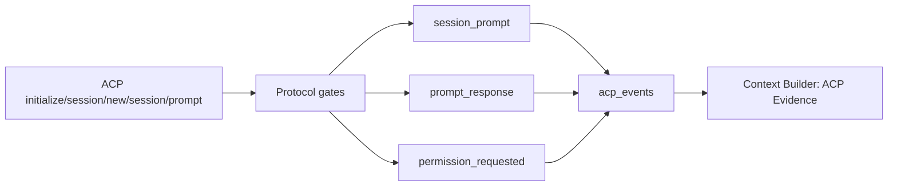

# APIForgeKit System Diagram

Este diagrama mostra o fluxo completo do MVP evidence-first, começando no ACP e no `SKILL.md`.

## APIForgeKit Evidence Harness

`Dotcontext MCP optional` guides an IDE workflow but does not replace the ACP executor or become a source of evidence. PostgreSQL, structured logs, raw exports and the original Evidence Pack remain canonical. `Optional Headroom CLI` runs only after Context Builder readiness and only on a sanitized handoff copy; it never sits in front of provider tests, labs, PostgreSQL, logs or ACP.

## Algorithm Test Lab

## Generic API Lab

## Token Calculator

## Provider/xAI Validation

## ACP Audit

## Operating Rule

Implementation starts only after evidence exists and Context Builder can explain what was validated, what failed, what payloads worked and where the evidence pack lives.
