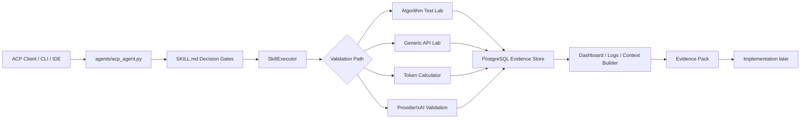
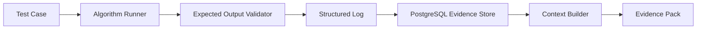
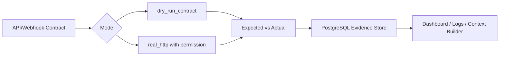
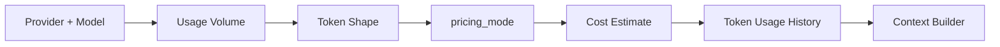
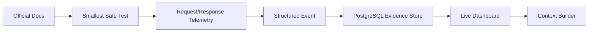

# APIForgeKit System Diagram

Este diagrama mostra o fluxo completo do MVP evidence-first, começando no ACP e no `SKILL.md`.

## Algorithm Test Lab

## Generic API Lab

## Token Calculator

## Provider/xAI Validation

## Operating Rule

Implementation starts only after evidence exists and Context Builder can explain what was validated, what failed, what payloads worked and where the evidence pack lives.
