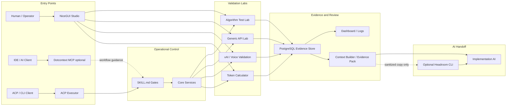

# APIForgeKit Harness Diagram Implementation Plan

> **For agentic workers:** REQUIRED SUB-SKILL: Use superpowers:subagent-driven-development (recommended) or superpowers:executing-plans to implement this plan task-by-task. Steps use checkbox (`- [ ]`) syntax for tracking.

**Goal:** Add one GitHub-renderable Mermaid overview of the APIForgeKit evidence harness without changing runtime behavior, dependencies, database models, ACP code or validation labs.

**Architecture:** Insert a high-level `flowchart LR` at the start of `docs/SYSTEM_DIAGRAM.md`; retain the focused diagrams below it. The overview distinguishes direct NiceGUI lab use from ACP/SKILL orchestration, labels Dotcontext and Headroom as optional, keeps PostgreSQL as the evidence source of truth, and only allows Headroom after Context Builder exports evidence.

**Tech Stack:** Markdown, Mermaid, pytest documentation contracts, `@mermaid-js/mermaid-cli` via temporary `npx`, existing local Google Chrome executable.

---

## File Structure

- `docs/SYSTEM_DIAGRAM.md`: public GitHub Mermaid diagram and its operating-rule explanation.
- `tests/test_system_diagram_docs.py`: structural contract for the six harness boundaries and forbidden Headroom runtime edges.
- `docs/superpowers/specs/2026-06-24-api-forgekit-harness-diagram-design.md`: approved source design; no change required.

### Task 1: Define the harness diagram contract

**Files:**
- Modify: `tests/test_system_diagram_docs.py`
- Test: `tests/test_system_diagram_docs.py`

- [x] **Step 1: Write the failing documentation contract**

Append this test after `test_system_diagram_doc_contains_full_acp_to_evidence_flow`:

```python
def test_system_diagram_documents_harness_boundaries_and_optional_tools():
    text = (ROOT / "docs" / "SYSTEM_DIAGRAM.md").read_text(encoding="utf-8")

    for expected in [
        "APIForgeKit Evidence Harness",
        "Human / Operator",
        "NiceGUI Studio",
        "IDE / AI Client",
        "Dotcontext MCP optional",
        "ACP / CLI Client",
        "SKILL.md Gates",
        "ACP Executor",
        "Core Services",
        "Algorithm Test Lab",
        "Generic API Lab",
        "xAI / Voice Validation",
        "Token Calculator",
        "PostgreSQL Evidence Store",
        "Dashboard / Logs",
        "Context Builder / Evidence Pack",
        "Optional Headroom CLI",
        "Implementation AI",
    ]:
        assert expected in text

    assert "headroomOpt --> evidenceStore" not in text
    assert "headroomOpt --> acpExecutor" not in text
    assert "headroomOpt --> algorithmLab" not in text
```

- [x] **Step 2: Run the focused test and verify it fails**

Run:

```powershell
$root = (Get-Location).Path
docker run --rm -v "${root}:/app" -w /app python:3.13-slim bash -lc "python -m pip install --no-cache-dir -r requirements.txt >/tmp/pip-install.log && python -m pytest -q tests/test_system_diagram_docs.py::test_system_diagram_documents_harness_boundaries_and_optional_tools"
```

Expected: fail because the harness overview and its labels do not exist yet.

### Task 2: Add the GitHub Mermaid harness overview

**Files:**
- Modify: `docs/SYSTEM_DIAGRAM.md` immediately after the introductory paragraph
- Test: `tests/test_system_diagram_docs.py`

- [x] **Step 1: Insert the overview heading and Mermaid source**

Insert this section before the existing `flowchart LR` block:

````markdown
## APIForgeKit Evidence Harness



`Dotcontext MCP optional` guides the IDE workflow; it is not an evidence store or an ACP replacement. `Optional Headroom CLI` is outside the validation runtime and operates only on a sanitized context copy after Context Builder has produced evidence. PostgreSQL, logs, raw exports and the original Evidence Pack remain canonical.
````

- [x] **Step 2: Run the focused tests and verify they pass**

Run:

```powershell
$root = (Get-Location).Path
docker run --rm -v "${root}:/app" -w /app python:3.13-slim bash -lc "python -m pip install --no-cache-dir -r requirements.txt >/tmp/pip-install.log && python -m pytest -q tests/test_system_diagram_docs.py"
```

Expected: all system diagram tests pass, including the new boundary contract.

### Task 3: Render the public Mermaid documentation before publishing

**Files:**
- Modify: no repository file
- Test: `docs/SYSTEM_DIAGRAM.md`

- [x] **Step 1: Create temporary Puppeteer configuration pointing to local Chrome**

Run:

```powershell
$tempRoot = Join-Path ([System.IO.Path]::GetTempPath()) ('apiforgekit-mermaid-' + [guid]::NewGuid().ToString('N'))
New-Item -ItemType Directory -Path $tempRoot | Out-Null
$configPath = Join-Path $tempRoot 'puppeteer.json'
$renderDir = Join-Path $tempRoot 'rendered'
New-Item -ItemType Directory -Path $renderDir | Out-Null
@{ executablePath = 'C:\Program Files\Google\Chrome\Application\chrome.exe'; headless = $true } | ConvertTo-Json | Set-Content -LiteralPath $configPath -Encoding utf8
```

- [x] **Step 2: Render every Mermaid diagram from the Markdown file**

Run:

```powershell
npx -y @mermaid-js/mermaid-cli@latest -i docs\SYSTEM_DIAGRAM.md -a $renderDir -p $configPath -q
$files = Get-ChildItem -LiteralPath $renderDir -File -Recurse
if ($files.Count -lt 7) { throw "Expected at least 7 SVG render artefacts, found $($files.Count)." }
$files | Select-Object Name, Length
```

Expected: the overview plus the six focused diagrams generate SVG artefacts with non-zero lengths.

- [x] **Step 3: Remove temporary render files**

Run:

```powershell
Remove-Item -LiteralPath $tempRoot -Recurse -Force
```

Expected: no Mermaid artefacts, Puppeteer configuration or browser data are written into the repository.

### Task 4: Full validation and publication

**Files:**
- Modify: `docs/SYSTEM_DIAGRAM.md`
- Modify: `tests/test_system_diagram_docs.py`
- Modify: `docs/superpowers/plans/2026-06-24-api-forgekit-harness-diagram.md`

- [x] **Step 1: Run documentation and application regressions**

Run:

```powershell
$root = (Get-Location).Path
docker run --rm -v "${root}:/app" -w /app python:3.13-slim bash -lc "python -m pip install --no-cache-dir -r requirements.txt >/tmp/pip-install.log && python -m pytest -q tests/test_system_diagram_docs.py tests/test_mvp_readiness_docs.py tests/test_acp_agent.py tests/test_context_builder.py && python -m compileall app.py core ui agents"
git diff --check
```

Expected: all selected tests pass, Python compilation succeeds, and the diff is whitespace-clean.

- [x] **Step 2: Confirm the intended change set**

Run:

```powershell
git status --short
git diff -- docs/SYSTEM_DIAGRAM.md tests/test_system_diagram_docs.py docs/superpowers/plans/2026-06-24-api-forgekit-harness-diagram.md
```

Expected: only the public diagram, its test, and this plan are uncommitted. No `.env`, `.context`, `.superpowers`, generated SVG, export or browser cache appears.

- [ ] **Step 3: Commit and push**

Run:

```powershell
git add docs/SYSTEM_DIAGRAM.md tests/test_system_diagram_docs.py docs/superpowers/plans/2026-06-24-api-forgekit-harness-diagram.md
git diff --cached --check
git commit -m "docs: add api forgekit harness diagram"
git push origin main
```

Expected: GitHub renders the overview on the existing System Diagram page with the focused diagrams still available below it.

## Plan Self-Review

- **Spec coverage:** Tasks 1 and 2 implement the approved six boundaries and optional tool rules; Task 3 proves GitHub-compatible Mermaid rendering before publication.
- **Scope:** no runtime code, service, dependency, database, Docker, ACP or UI behavior changes occur.
- **Consistency:** every occurrence uses the same node IDs that the test protects: `headroomOpt`, `evidenceStore`, `acpExecutor`, and `algorithmLab`.
- **Placeholder scan:** the plan includes complete Mermaid source, test assertions, render command and cleanup command.
